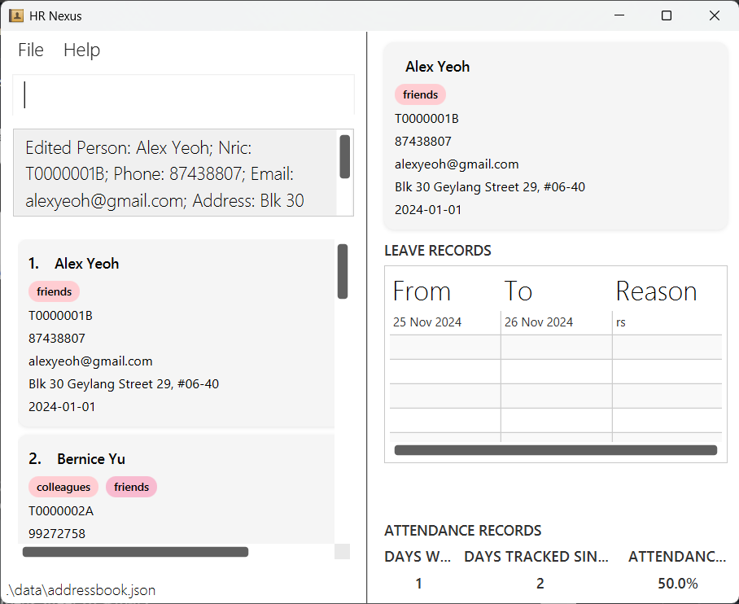
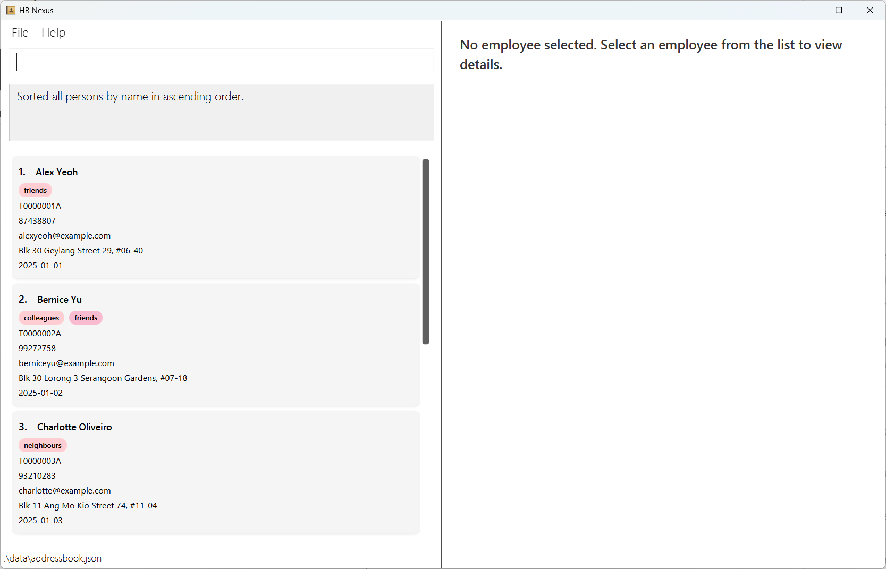
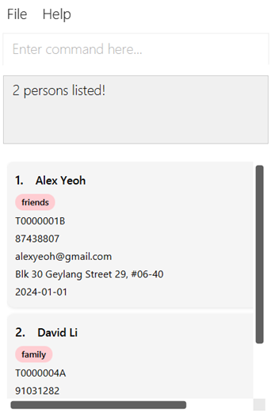

# HR Nexus User Guide

HR Nexus is a desktop app designed for SMEs to simplify employee management, especially for businesses with limited or
no dedicated HR personnel. It helps you keep track of essential employee records in one place, including personal details,
attendance records, and leave history.

With a clean and intuitive interface combining both Command Line (CLI) efficiency and Graphical User Interface (GUI),
HR Nexus makes it easy to stay organized without the overhead of a full-fledged HR system. It is a lightweight, practical
solution to help you lay the foundation for a more efficient HR process in the future.

<!-- * Table of Contents -->
<page-nav-print />

--------------------------------------------------------------------------------------------------------------------

## Get started in minutes

#### Prerequisites
- **Java 17 or later**
  - Verify with `java -version` in your terminal.
    - You should see something like `java version "17.X.X"` in the output.
  - If you don't have Java 17 installed, you can download and install it [here](https://www.oracle.com/java/technologies/downloads/#java17).
  - For Mac users, ensure you have the precise JDK version prescribed [here](https://se-education.org/guides/tutorials/javaInstallationMac.html).


#### Steps
1. Download the `HRNexus.jar` file
   -  Click [here](https://github.com/AY2425S2-CS2103T-T15-3/tp/releases) to grab the latest version
2. Run the app
   - Move the downloaded `HRNexus.jar` file to a folder of your choice.
   - Open your preferred terminal and navigate to the same folder using:
       ```ps
       cd /path/to/folder
       ```
   - Then, start HR Nexus with:
       ```properties
       java -jar HRNexus.jar
       ```
- A GUI similar to the below should appear in a few seconds. Note how the app contains some sample data.
    

1. Type the command in the command box and press Enter to execute it. e.g. typing **`help`** and pressing Enter will open the help window.<br>
   Some example commands you can try:

   * Lists all employees:
      ```properties
      list
      ```

   * Add an employee named **John Doe**:
      ```properties
      add /name John Doe /nric S1234567A /email johnd@example.com /phone 98765432 /address John street, block 123, #01-01 /hire 2025-03-05
      ```

   * Delete the first employee:
      ```properties
      delete 1
      ```

   * Deletes all employees:
      ```properties
      clear
      ```

   * Exits the app:
      ```properties
      exit
      ```

1. Refer to the [Features](#features) below for more details on each command.

--------------------------------------------------------------------------------------------------------------------

## Features

<box type="info" header="## Notes on the command format" seamless>

```properties
command [IDENTIFIER] [/field PARAMETER]...
```
* **Elements in square brackets** are **optional**. Not all commands require them.
    - For example, the `clear` command does not require any parameters:
     ```properties
     clear
     ```
* **Identifiers**: These are used to specify the target employee for certain commands.
* **Fields** (flags): The command prefixes like: `/name`, `/nric`, `/phone`, etc.
* **Parameters**: The actual values you supply like: `John Doe`, `S1234567A`, `98765432`, etc.
  * **Parameters** followed by `…`​ accept multiple space-separated values.
    - For example, the `attendance` command can be used in the following ways:
      - If `NRIC` is not provided, it marks all employees as present.
      - If one or more `NRIC` are provided, it marks the specified employees as absent.
      - Any invalid `NRIC` provided will be ignored and will not have any effect on the attendance of other employees/

        ```properties
        attendance /absent
        attendance /absent S1234567A
        attendance /absent S1234567A S2345678B
        ```


* **Parameters** are **not positional** and **can be given in any order**.
  - The following commands are equivalent:
    ```properties
    add /name NAME /nric NRIC /phone PHONE_NUMBER /email EMAIL /address ADDRESS /hire DATE
    add /hire DATE /addre ADDRESS /email EMAIL /phone PHONE_NUMBER /nric NRIC /name NAME
    ```
* Extraneous parameters for commands that do not take in parameters (such as `help`, `list`, `exit` and `clear`) will be ignored.<br>
  - If the command specifies `help 123`, it will be interpreted as `help`.
<p></p>

* If you are using a PDF version of this document, be careful when copying and pasting commands that span multiple lines as space characters surrounding line-breaks may be omitted when copied over to the application.
</box>
<br>

<panel type="seamless" header="### Viewing help: `help`{.properties}" expanded no-close no-switch>

##### Shows a message explaining how to access the help page.
**Format:**
```properties
help
```
**Output:**

</panel>

<panel type="seamless" header="### Adding an employee: `add`{.properties}" expanded no-close no-switch>

##### Adds an employee to the system.

**Compulsory fields:** `name`, `nric`, `phone`, `email`, `address`, `hire`.

**Compulsory Parameters (Should neither be blank nor only contain spaces, if not error will be shown):**
- `NAME` refers to the employee's name. Names should only contain alphanumeric characters and spaces.
- `NRIC` refers to the employee's NRIC and should be unique for each employee. NRIC should begin with one of "S"/"T"/"F"/"G"/"M"/"s"/"t"/"f"/"g"/"m", followed by 7 numerical characters, and end with 1 alphabetical character (e.g., S7654321A).
- `PHONE` refers to the employee's phone number and it should be at least 3 digits long.
- `EMAIL` refers to the employee's email and it should be in the format of "local-part@domain". The local-part should only contain alphanumeric characters and these special characters `+_.-` and it should not start or end with any special characters. The domain name must end with a domain label at least 2 characters long, have each domain label start and end with alphanumeric characters, and have each domain label consist of alphanumeric characters, separated only by hyphens, if any.
- `ADDRESS` refers to the employee's address. Addresses can take any values.
- `DATE` refers to the employee's date of hire. It must meet all these requirements:
   1. FORMAT: Must use yyyy-MM-dd (e.g., 2025-02-28).
   2. YEAR RANGE: Must be between 1900 to 2099 (inclusive).
   3. VALID DATE: Must be a real calendar date. February has 28 days (29 in leap years). April, June, September, November have 30 days each. Other months have 31 days each.
- All parameters are compulsory and an error message will be shown if any of the parameters is not provided.
- All parameters must be in their respective valid format as described above, if not, an error message will be shown.

**Format:**
```properties
add /name NAME /nric NRIC /phone PHONE_NUMBER /email EMAIL /address ADDRESS /hire DATE
```

**Examples:**
```properties
add /name John Doe /nric S1234567A /email johnd@example.com /phone 98765432 /address John street, block 123, #01-01 /hire 2025-03-05
```
</panel>

<panel type="seamless" header="### Adding a tag: `addtag`{.properties}" expanded no-close no-switch>

##### Adds a tag (role or skill) to the specified employee.

**Compulsory parameters (Should neither be blank nor only contain spaces, if not error will be shown):**
- `INDEX` refers to the target employee's position in the currently displayed list. It should be a non-zero unsigned integer.
- `TAG` refers to the tag that we want to add to the target employee. It must be a non-empty string and can only contain letters, numbers, spaces, `'` and `-`.
- If the employee already has the same tag, an error message will be shown.
- All parameters are compulsory and error message will be shown if any of the parameters is not provided.
- All parameters must be in their respective valid format as described above, if not, an error message will be shown.

**Format:**
```properties
addtag INDEX TAG
```

**Examples:**
- Add the tag `Software Developer` to the **1st** employee:
```properties
addtag 1 Software Developer
```

**Output:**
```
Tag "Software Developer" added successfully to John Doe.
```
</panel>

<panel type="seamless" header="### Removing a tag: `removetag`{.properties}" expanded no-close no-switch>

##### Removes a tag from the specified employee.

**Compulsory Parameters (Should neither be blank nor only contain spaces, if not error will be shown):**
- `INDEX` refers to the target employee's position in the currently displayed list. It should be a non-zero unsigned integer.
- `TAG` refers to a tag that has been previously added to the target employee. It must be a non-empty string and can only contain letters, numbers, spaces, `'` and `-`.
- If `TAG` is not a tag that has already been previously added to the target employee, an error message will be shown.
- All parameters are compulsory and an error message will be shown if any of the parameters is not provided.
- All parameters must be in their respective valid format as described above, if not, an error message will be shown.

**Format:**
```properties
removetag INDEX TAG
```

**Examples:**
- Remove the tag `Software Developer` from the **1st** employee:
```properties
removetag 1 Software Developer
```

**Output:**
```
Tag "Software Developer" removed successfully from John Doe.
```
</panel>

<panel type="seamless" header="### Managing leaves: `leave`{.properties}" expanded no-close no-switch>

##### Adds leave entries for employees.

**Compulsory fields:** `start`, `end`, `reason`.

**Compulsory Parameters (Should neither be blank nor only contain spaces, if not error will be shown):**
- `IDENTIFIER` can be either:
    - An employee index that should be a non-zero unsigned integer(e.g., `1`), or
    - A valid NRIC that begins with one of "S"/"T"/"F"/"G"/"M"/"s"/"t"/"f"/"g"/"m", followed by 7 numerical characters, and end with 1 alphabetical character (e.g., S7654321A).
- `START_DATE` refers to the starting date of the target employee's leave. 
- `END_DATE` refers to the ending date of the target employee's leave. 
- `START_DATE` and `END_DATE` must meet all these requirements:
    1. FORMAT: Must use yyyy-MM-dd (e.g., 2025-02-28).
    2. YEAR RANGE: Must be between 1900 to 2099 (inclusive).
    3. VALID DATE: Must be a real calendar date. February has 28 days (29 in leap years). April, June, September, November have 30 days each. Other months have 31 days each.
    4. DATE ORDER: `START_DATE` must be on or before `END_DATE`.
    5. DURATION: Must be less than or equal to 30 days.
- `REASON` refers to the target employee's reason for taking the leave. It must be a non-empty string and can contain spaces.
- The period of the leave should not overlap with the period of the target employee's any other leaves. If it overlaps, an error message will be shown.
- All parameters are compulsory and an error message will be shown if any of the parameters is not provided.
- All parameters must be in their respective valid format as described above, if not, an error message will be shown.

<panel type="seamless" header="#### Adding a leave entry `leave add`{.properties}" expanded no-close no-switch>

**Format:**
```properties
leave add IDENTIFIER /start START_DATE /end END_DATE /reason REASON
```
**Examples:**
- Two available approaches of adding a leave entry for the employee with the **INDEX**`1`and **NRIC** `S1234567A`:
```properties
leave add S1234567A /start 2025-03-05 /end 2025-03-07 /reason Sick Leave
leave add 1 /start 2025-03-05 /end 2025-03-07 /reason Sick Leave
```
**Output:**
```
Leave added: 2025-03-05 to 2025-03-07 (Sick Leave) for John Doe
```

##### Removes leave entries for employees.

**Compulsory fields:** `start`.

**Compulsory Parameters (Should neither be blank nor only contain spaces, if not error will be shown):**
- `IDENTIFIER` can be either:
    - An employee index that should be a non-zero unsigned integer(e.g., `1`), or
    - A valid NRIC that begins with one of "S"/"T"/"F"/"G"/"M"/"s"/"t"/"f"/"g"/"m", followed by 7 numerical characters, and end with 1 alphabetical character (e.g., S7654321A).
- `START_DATE` refers to the starting date of the target employee's leave. It must meet all these requirements:
    1. FORMAT: Must use yyyy-MM-dd (e.g., 2025-02-28).
    2. YEAR RANGE: Must be between 1900 to 2099 (inclusive).
    3. VALID DATE: Must be a real calendar date. February has 28 days (29 in leap years). April, June, September, November have 30 days each. Other months have 31 days each.
    4. MATCHING: Must match with one of the start dates of the target employee's leaves.
- All parameters are compulsory and an error message will be shown if any of the parameters is not provided.
- All parameters must be in their respective valid format as described above, if not, an error message will be shown.

</panel>

<panel type="seamless" header="#### Removing a leave entry `leave remove`{.properties}" expanded no-close no-switch>

**Format:**
```properties
leave remove IDENTIFIER /start START_DATE
```

**Examples:**
- Two available approaches of removing a leave entry for the employee with the **INDEX**`1`and **NRIC** `S1234567A`:
```properties
leave remove S1234567A /start 2025-03-05
leave remove 1 /start 2025-03-05
```

**Output:**
```
Leave removed: 2025-03-05 to 2025-03-07 (Sick Leave) for John Doe
```
</panel>
</panel>

<panel type="seamless" header="### Managing attendance: `attendance`{.properties}" expanded no-close no-switch>

##### Marks employee attendance (present/absent) in the system.

**Compulsory fields:** `absent`

**Optional parameters:**
- `NRIC...` refers to a list of employees' NRIC which represent the employees we want to mark as absent. It should begin with one of "S"/"T"/"F"/"G"/"M"/"s"/"t"/"f"/"g"/"m", followed by 7 numerical characters, and end with 1 alphabetical character (e.g., S7654321A).
- Any parameter added must be in its valid format as described above, if not, an error message will be shown.

**Behavior:**
- When no NRIC provided: Marks all employees as **present**
- When NRIC provided: For employees with NRIC that matches one of the NRICs on the list, they are marked as **absent**. Remaining employees are marked as **present**. NRICs in the list that do not match with any employee will be ignored and will not add up to the number count of absentees. Duplicated NRICs will be treated as just one NRIC of that alphanumerical sequence.
- Matching of NRIC from employee to the list is case-insensitive, e.g. s0123456a matches S0123456A.

**Format:**
```properties
attendance /absent [NRIC...]
```
**Examples:**
- Mark all employees except those with the NRIC `S1234567A` and `S2345678B` as present:
```properties
attendance /absent S1234567A S2345678B
```

**Output:**
```
Attendance added: 2 person marked as absent.
```

</panel>


<panel type="seamless" header="### Listing all employees: `list`{.properties}" expanded no-close no-switch>

##### Shows a list of all employees in the HR Nexus system.

**Format:**
```properties
list
```
**Output:**

</panel>

<panel type="seamless" header="### Sorting employees: `sort`{.properties}" expanded no-close no-switch>

##### Sorts the employee list by the specified field in either ascending or descending order.

**Compulsory Parameters (Should neither be blank nor only contain spaces, if not error will be shown):** 
- `FIELD` refers to the specified field of the employees we want to use for sorting. It must be just one of `name`, `nric`,`phone`,`email`,`address`,`hire`.
- `DIRECTION` refers to the ordering direction that we want to use for sorting. It must be either `asc` (ascending) or `desc` (descending).
- All parameters are compulsory and an error message will be shown if any of the parameters is not provided.
- All parameters must be in their respective valid format as described above, if not, an error message will be shown.

**Format:**
```properties
sort FIELD DIRECTION
```

**Examples:**
- Sort employees by name in ascending order:
```properties
sort name asc
```

**Output:**



</panel>

<panel type="seamless" header="### Viewing employee details: `view`{.properties}" expanded no-close no-switch>

##### Displays comprehensive details of the specified employee on the **right** panel.

**Compulsory Parameters (Should neither be blank nor only contain spaces, if not error will be shown):**
- `INDEX` refers to the target employee's position in the currently displayed list. It should be a non-zero unsigned integer(e.g., `1`).
- All parameters are compulsory and an error message will be shown if any of the parameters is not provided.
- All parameters must be in their respective valid format as described above, if not, an error message will be shown.

**Format:**
```properties
view INDEX
```
**Examples:**
```properties
view 2
```

**Output:**

The details of the **2nd** employee in the list will be displayed on the right panel.


</panel>

<panel type="seamless" header="### Editing an employee: `edit`{.properties}" expanded no-close no-switch>

##### Edits an existing employee by updating input values in the HR Nexus system.

**Optional Fields:** `name`,`nric`,`phone`,`email`,`address`,`hire`

**Compulsory Parameters (Should neither be blank nor only contain spaces, if not error will be shown):**
- `INDEX` refers to the target employee's position in the currently displayed list. It should be a non-zero unsigned integer(e.g., `1`).
- All parameters are compulsory and an error message will be shown if any of the parameters is not provided.
- All parameters must be in their respective valid format as described above, if not, an error message will be shown.

**Optional Parameters:**
- `NAME` refers to the target employee's name. Names should only contain alphanumeric characters and spaces.
- `NRIC` refers to the target employee's NRIC and should be unique for each employee. NRIC should begin with one of "S"/"T"/"F"/"G"/"M"/"s"/"t"/"f"/"g"/"m", followed by 7 numerical characters, and end with 1 alphabetical character (e.g., S7654321A).
- `PHONE` refers to the target employee's phone number and it should be at least 3 digits long.
- `EMAIL` refers to the target employee's email and it should be in the format of "local-part@domain". The local-part should only contain alphanumeric characters and these special characters `+_.-` and it should not start or end with any special characters. The domain name must end with a domain label at least 2 characters long, have each domain label start and end with alphanumeric characters, and have each domain label consist of alphanumeric characters, separated only by hyphens, if any.
- `ADDRESS` refers to the target employee's address. Addresses can take any values.
- `DATE` refers to the target employee's date of hire. It must meet all these requirements:
    1. FORMAT: Must use yyyy-MM-dd (e.g., 2025-02-28).
    2. YEAR RANGE: Must be between 1900 to 2099 (inclusive).
    3. VALID DATE: Must be a real calendar date. February has 28 days (29 in leap years). April, June, September, November have 30 days each. Other months have 31 days each.
- At least one of the parameters need to be present and an error message will be shown if none of these parameters is provided.
- Any parameter added must be in its respective valid format as described above, if not, an error message will be shown.

**Format:**
```properties
edit INDEX [/name NAME] [/nric NRIC] [/phone PHONE] [/email EMAIL] [/address ADDRESS] [/hire DATE]
```
- Edits the person at the specified INDEX.
- The index refers to the index number shown in the displayed person list.
- The index must be a positive integer 1, 2, 3, …​
- Any parameters specified of the person  will be edited if format is valid

**Behaviours:**
- If there are any duplicate fields e.g. `edit 1 /name hans /name bo` then the last duplicate will take effect i.e.
(name will be edited to 'bo'). All other duplicates will be ignored.

**Examples:**
- Edit the name of the **1st** employee to be `Robert Lee`:
```properties
edit 1 /name Robert Lee
```
**Output:**
```
Edited Person: Robert Lee; Nric: T0000001A; Phone: 87438807; Email: alexyeoh@example.com; Address: Blk 30 Geylang Street 29, #06-40; Hire: 2025-01-01; Tags: friends
```
</panel>

<panel type="seamless" header="### Find employee by **name**: `find`{.properties}" expanded no-close no-switch>

##### Finds employees whose **names** contain any of the given keywords.

**Compulsory Parameters (Should neither be blank nor only contain spaces, if not error will be shown):**
- `KEYWORD` refers to the word that would be used to check whether each employee's name contains it. It should be a non-empty string.
- All parameters are compulsory and an error message will be shown if any of the parameters is not provided.
- All parameters must be in their respective valid format as described above, if not, an error message will be shown.

**Optional Parameters:**
- `MORE_KEYWORDS` refers to additional words that would also be used to check whether each employee's name contains it. It should be a non-empty string.
- Any parameter added must be in its respective valid format as described above, if not, an error message will be shown.

- **Format:**
```properties
find KEYWORD [MORE_KEYWORDS]
```

**Behaviours:**
* The search is case-insensitive. e.g `hans` will match `Hans`
* The order of the keywords does not matter. e.g. `Hans Bo` will match `Bo Hans`
* Only the name is searched.
* Only full words will be matched e.g. `Han` will not match `Hans`
* Persons matching at least one keyword will be returned (i.e. `OR` search).
  e.g. `Hans Bo` will return `Hans Gruber`, `Bo Yang`

**Examples:**
- Find persons with the name `alex` and `david`:
```properties
find alex david
```


**Output:**

Returns both `Alex Yeoh` and `David Li`

</panel>

<panel type="seamless" header="### Deleting an employee: `delete`{.properties}" expanded no-close no-switch>

##### Deletes the specified person from the HR Nexus system.

**Compulsory Parameters (Should neither be blank nor only contain spaces, if not error will be shown):**
- `INDEX` refers to the target employee's position in the currently displayed list. It should be a non-zero unsigned integer(e.g., `1`).
- All parameters are compulsory and an error message will be shown if any of the parameters is not provided.

**Format:**
```properties
delete INDEX
```

* Deletes the person at the specified `INDEX`.
* The index refers to the index number shown in the displayed person list.
* The index **must be a positive integer** 1, 2, 3, …​

**Examples:**
- First, list all employees, then delete the **1st** employee in the list:
```properties
list
delete 1
```

**Output:**

The **1st** employee in the list will be deleted.
```
Deleted Person: Robert Lee; Nric: T0000001A; Phone: 87438807; Email: alexyeoh@example.com; Address: Blk 30 Geylang Street 29, #06-40; Hire: 2025-01-01; Tags: friends
```

</panel>

<panel type="seamless" header="### Clearing all entries : `clear`{.properties}" expanded no-close no-switch>

##### Clears all employee entries from the HR Nexus system.

Format:
```properties
clear
```

**Output:**
```
Address book has been cleared!
```
</panel>

<panel type="seamless" header="### Exiting the program : `exit`{.properties}" expanded no-close no-switch>

##### Exits the program.

Format:
```properties
exit
```
</panel>
<br>

## Data Storage
HR Nexus automatically saves your data to disk after any command that modifies it. There is no need to perform manual saves.


### Data file location
Employee records are stored in a JSON file `addressbook.json` located at:
```ps
[HRNexus.jar file location]/data/addressbook.json
```

### Editing the data file

Advanced users can directly edit the data file if they are familiar with JSON. The data is stored in a format that is easy to understand and edit.
However, it is recommended to use the app to edit the data file whenever possible.

<box type="warning" header="#### Caution" icon-size="2x" seamless>

Editing the data file manually can lead to issues if the file format becomes invalid. If the file cannot be parsed on startup, HR Nexus will discard its contents and create a new, empty data file.
We strongly recommend creating a backup before making any changes.

Additionally, incorrect edits (e.g., values outside acceptable ranges or missing fields) may cause HR Nexus to behave unexpectedly. Proceed only if you are confident in editing JSON files safely.
</box>

### Archiving data files `[coming in v2.0]`

_Details coming soon ..._

--------------------------------------------------------------------------------------------------------------------

## FAQ

**Q**: How do I transfer my data to another Computer?<br>
**A**: Install the app in the other computer and overwrite the empty data file it creates with the file that contains the data of your previous AddressBook home folder.

--------------------------------------------------------------------------------------------------------------------

## Known issues

1. **When using multiple screens**, if you move the application to a secondary screen, and later switch to using only the primary screen, the GUI will open off-screen. The remedy is to delete the `preferences.json` file created by the application before running the application again.
2. **If you minimize the Help Window** and then run the `help` command (or use the `Help` menu, or the keyboard shortcut `F1`) again, the original Help Window will remain minimized, and no new Help Window will appear. The remedy is to manually restore the minimized Help Window.

--------------------------------------------------------------------------------------------------------------------

## Command Summary

### Employee Management
| Command | Format                                                                                               | Example |
|---------|------------------------------------------------------------------------------------------------------|---------|
| **Add** | `add /name NAME /nric NRIC /phone PHONE /email EMAIL /address ADDRESS /hire DATE`                    | `add /name John Doe /nric S1234567A /phone 98765432 /email johnd@example.com /address "123 Street" /hire 2025-01-01` |
| **Edit** | `edit INDEX [/name NAME] [/nric NRIC] [/phone PHONE] [/email EMAIL] [/address ADDRESS] [/hire DATE]` | `edit 1 /name Robert Lee /phone 87654321` |
| **Delete** | `delete INDEX`                                                                                       | `delete 2` |
| **List** | `list`                                                                                               | `list` |
| **Find** | `find KEYWORD [MORE_KEYWORDS]`                                                                       | `find John Alex` |
| **View** | `view INDEX`                                                                                         | `view 1` |
| **Sort** | `sort FIELD DIRECTION`                                                                               | `sort name asc` |
| **Attendance** | `attendance /absent [NRIC...]`                                                                       | `attendance /absent S1234567A S2345678B` |

### Leave Management
| Command | Format | Example |
|---------|--------|---------|
| **Add Leave** | `leave add IDENTIFIER /start DATE /end DATE /reason REASON` | `leave add 1 /start 2025-03-01 /end 2025-03-03 /reason "Annual Leave"` |
| **Remove Leave** | `leave remove IDENTIFIER /start DATE` | `leave remove S1234567A /start 2025-03-01` |

### Tag Management
| Command | Format | Example |
|---------|--------|---------|
| **Add Tag** | `addtag INDEX TAG` | `addtag 1 "Senior Developer"` |
| **Remove Tag** | `removetag INDEX TAG` | `removetag 1 "Junior"` |

### System Operations
| Command | Format |
|---------|--------|
| **Clear** | `clear` |
| **Help** | `help` |
| **Exit** | `exit` |

<br>

<box type="info">

**Legend:**
- `UPPER_CASE`: Parameters you should replace with actual values
- `[]`: Optional parameters
- `INDEX`: Positive integer (1, 2, 3,...)
- `IDENTIFIER`: Employee index or NRIC
- `DATE`: YYYY-MM-DD format
- `/field`: Command flag prefix
</box>
